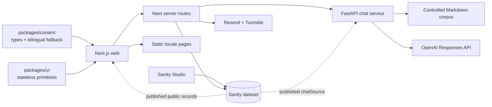

# Architecture

## System overview

The npm workspaces are `apps/*` and `packages/*`. The Python chat service is outside that workspace and is installed, tested and deployed separately.

## Frontend and rendering

`apps/web` is a Next.js 16 App Router application. Server Components are the default: layouts and editorial pages fetch data and render HTML on the server. Client Components are limited to browser APIs, local interaction and animation.

The root layout imports the global stylesheet and mounts the persistent Canvas 2D field, route transition and default-enabled audio control. The locale layout validates `es`/`en`, supplies navigation, footer, consent and the chat drawer, and updates the document language after hydration.

The build prerenders:

- `/` as a redirect to `/es`;
- `/es` and `/en` home pages;
- locale-prefixed About, Contact, Privacy and Projects pages;
- every locale/project slug pair known to `packages/content`;
- manifest, robots and sitemap metadata routes.

`/api/chat`, `/api/contact` and `/api/testimonials` are dynamic server routes. The presence of these routes means the application is not a pure static export.

## Routing and layouts

| Route | Rendering and responsibility |
| --- | --- |
| `/` | Server redirect to `/es` |
| `/[locale]` | SSG home assembled from portfolio content and approved testimonials |
| `/[locale]/projects` | SSG project index |
| `/[locale]/projects/[slug]` | SSG project case; unknown locale or slug returns 404 |
| `/[locale]/about` | SSG profile, timeline, credentials and testimonials |
| `/[locale]/contact` | SSG shell with client contact form |
| `/[locale]/privacy` | SSG privacy copy |
| `/api/chat` | Node runtime proxy to FastAPI |
| `/api/contact` | Validated Turnstile/Resend workflow |
| `/api/testimonials` | Approved testimonial read and moderated submission |

`generateStaticParams` is driven by the two typed locales and local project slugs. Sanity cannot introduce a new web project route by itself because the merge only overlays projects already present in the local fallback.

## Content architecture

There are three distinct content paths; they must not be conflated.

### Typed web fallback

`packages/content` owns public TypeScript contracts, the complete ES/EN fallback and the navigation dictionary. It is the credential-free source for the web and for static sitemap/project paths.

### Sanity editorial content

`apps/studio` defines the editorial schemas. The web performs token-free public reads only when a project ID is configured and only requests records marked published, visible and non-confidential. A five-minute Next revalidation window is used.

The current web merge is intentionally partial:

- selected profile fields may override the local profile;
- existing local projects may receive selected CMS fields;
- known certifications may be overridden and valid new certifications may be appended;
- About, timeline, capabilities and hobbies remain local;
- several Studio schemas and media fields are not wired to the web.

An HTTP, parsing or configuration failure returns the complete typed fixture. The web does not persist a last-known-good CMS copy.

### Chat knowledge

The chat service does not import `packages/content`. `document_catalog.yaml` allowlists controlled Markdown documents and `chat_core.py` provides deterministic project search, safe document reads, context selection and public-output sanitisation.

Published Sanity `chatSource` records can augment the local catalog. `content_repository.py` writes an atomic cache and can fall back to its last valid copy or local Markdown. The merged catalog is built when the service module starts, so CMS changes require a process restart in the current implementation.

## State and data flow

The React interface has no global store or Context-based application state. Interactive components use local `useState` and refs. Server content calls are deduplicated with `React.cache`.

Browser persistence is intentionally small:

- consent is stored in local storage;
- the three-part audio playlist is enabled by default at a moderated volume; browser autoplay policy may defer audible playback until the first interaction;
- chat conversation history is not stored in the browser.

FastAPI keeps conversation sessions, rate limits, queue tickets, concurrency limits and the monthly request budget in process memory. The session cookie is opaque, HttpOnly and SameSite Lax; Secure is configurable. This state is neither durable nor shared across replicas. The Docker command therefore runs one Uvicorn worker.

## Server APIs and external services

### Chat

The drawer posts `{ message, detailLevel, resetConversation }` to Next. The proxy forwards the request body, origin, session cookie, a validated Vercel client IP and cancellation signal to FastAPI, then relays the upstream body and cookie. In production, both services share a server-only `CHAT_PROXY_SECRET`; FastAPI rejects direct chat calls that do not carry it.

After streaming starts, FastAPI emits newline-delimited events: `queued`, `status`, zero or more `delta`, `metrics`, then `done`, or a streamed `error`. Validation, origin, rate-limit, budget and missing-provider failures that happen before `StreamingResponse` exists use normal FastAPI JSON errors.

Generation has two stages: an unpublished planning pass must use an allowlisted retrieval tool, then a public response is streamed. The sanitizer operates across delta boundaries and blocks private identifiers, planning text and internal tool details.

### Contact

The Next route validates JSON with Zod, checks a honeypot and an in-memory per-IP window, optionally verifies Cloudflare Turnstile, and sends mail through Resend. Missing provider configuration returns a controlled unavailable state.

### Testimonials

Public reads return only approved Sanity documents and refresh at most one minute after cache revalidation. Both Home and About call the same repository function and render the same shared section. Submissions are schema validated, same-origin checked when an Origin header is present, rate limited in memory and idempotently created as `pending` with a server-only write token. Publication is always manual. A successful stored submission also triggers a Resend notification to the canonical portfolio inbox when mail is configured; notification failure never discards the stored review.

### Other integrations

Google Fonts supplies the configured typefaces. Project video uses `youtube-nocookie.com`, lazy loading and no autoplay. All local raster media is rendered with `next/image`.

## Internationalisation

The supported locales are the typed tuple `es` and `en`. Public structured content uses `LocalizedText`, navigation uses a typed dictionary and `requireLocale` rejects unsupported route segments. The language switch preserves the current path, query, hash and scroll through the route transition component.

The root HTML starts with `lang="es"`; the locale wrapper has the correct server-rendered `lang`, and `DocumentLanguage` updates the root attribute after hydration for English routes.

## Styling and animation

`apps/web/app/globals.css` owns tokens, resets, component selectors, responsive rules and reduced-motion handling. Tailwind 4 is available through PostCSS, but the current UI is primarily semantic JSX plus hand-written CSS. Later sections of the stylesheet intentionally override earlier revision blocks, so cascade order matters.

Active motion includes:

- Motion-based pixel route transition, chat transitions, reveals, timeline disclosure and carousel scrolling;
- a manually drawn Canvas 2D ambient field with reduced-motion, data-saving and visibility fallbacks;
- restrained CSS transitions/keyframes;
- a default-enabled audio fade driven by `requestAnimationFrame`, with first-interaction recovery when browser autoplay policy blocks the initial play request.

The route transition intercepts internal navigation and owns the fetch timing. Internal `Link` prefetch is disabled so that a locale transition cannot issue speculative React Server Component requests with the previous locale tree; clicks still use `router.push` and preserve the reduced-motion/data-saving bypass.

`components/canvas/hero-visual.tsx` and `tide-canvas.tsx` contain a dynamically isolated Three.js experiment with a static fallback, but no route imports it. Three.js is residual source, not part of the rendered production experience.

## Analytics and privacy

The Next client loads PostHog dynamically only after explicit consent, respects Do Not Track, disables autocapture and session recording, and emits a manual consented page-view event. It does not currently install a route-change tracker.

The inherited chat client contains a separate consent-aware PostHog path exposed through `/api/public-config`; only allowlisted EU/US PostHog hosts and a public project key can be returned. Server secrets are never exposed.

## Delivery

GitHub Actions has separate web and chat jobs. The web job uses Node 22, runs `npm ci`, `npm run check` and `npm run build`. The chat job uses Python 3.12, installs pinned requirements and runs `unittest`.

The repository contains no web deployment workflow or Vercel, Render, Netlify, Railway or Cloudflare descriptor. `services/chat-api/Dockerfile` is the only production delivery descriptor: Python 3.11 slim, non-root user, one Uvicorn worker and a configurable port. Sanity configuration defines the authoring application but not an automated deployment.
